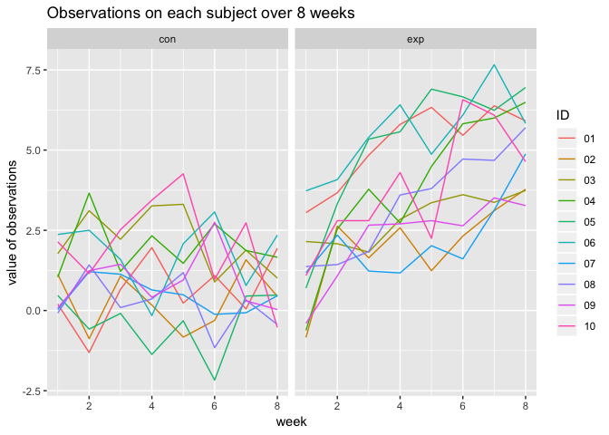

p8105\_hw5\_zf2211
================
Francis
11/6/2018

### Problem 1

``` r
#load packages
library(tidyverse)
```

    ## ── Attaching packages ───────────────────────────────────────────────────────────────────────── tidyverse 1.2.1 ──

    ## ✔ ggplot2 3.1.0     ✔ purrr   0.2.5
    ## ✔ tibble  1.4.2     ✔ dplyr   0.7.7
    ## ✔ tidyr   0.8.2     ✔ stringr 1.3.1
    ## ✔ readr   1.1.1     ✔ forcats 0.3.0

    ## ── Conflicts ──────────────────────────────────────────────────────────────────────────── tidyverse_conflicts() ──
    ## ✖ dplyr::filter() masks stats::filter()
    ## ✖ dplyr::lag()    masks stats::lag()

``` r
# conbine all file names into one dataframe
file = as.data.frame(list.files(path = "./data")[1:20]) 
# rename column
colnames(file)[1] = 'path'
```

``` r
# create a function to read data one by one 
read_files = function (path) {
  df = 
    read.csv(str_c("./data/", path)) %>% 
    janitor::clean_names() %>% 
    as.data.frame()
  df
}
```

``` r
# save the results as new variables in the dataframe
data <- 
  map(file$path, read_files) %>% 
  bind_rows()
data <- 
bind_cols(file, data)
```

``` r
## tidy dataset
# transform the dataframe in one colume
# clean variable names
data <-  
  data %>% 
  gather(key = week, value = value, week_1:week_8) %>% 
  separate(path, into = c("group", "appendix"), sep = "_") %>% 
  separate(appendix, into = c("ID", "remove_1"), sep = 2 ) %>% 
  separate(week, into = c("remove_2", "week"), sep = "_") %>% 
  select(-remove_1, -remove_2) %>% 
  mutate(group = as.factor(group)) %>% 
  arrange(group, ID, week)
```

``` r
# spaghette plot showing observations on each subject over time
data %>% 
  group_by(ID) %>% 
  ggplot(aes(x = as.numeric(week), y = value, color = ID)) +
  geom_line() +
  facet_grid(.~group) +
  labs(title = "Observations on each subject over 8 weeks", 
       x = "week",
       y = "value of observations"
       )
```


