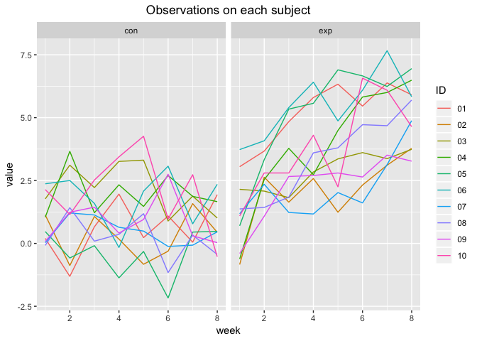

p8105\_hw5\_zf2211
================
Francis
11/6/2018

### Problem 1

``` r
#load packages
library(tidyverse)
```

    ## ── Attaching packages ───────────────────────────────────────────────────────────────────────── tidyverse 1.2.1 ──

    ## ✔ ggplot2 3.1.0     ✔ purrr   0.2.5
    ## ✔ tibble  1.4.2     ✔ dplyr   0.7.7
    ## ✔ tidyr   0.8.2     ✔ stringr 1.3.1
    ## ✔ readr   1.1.1     ✔ forcats 0.3.0

    ## ── Conflicts ──────────────────────────────────────────────────────────────────────────── tidyverse_conflicts() ──
    ## ✖ dplyr::filter() masks stats::filter()
    ## ✖ dplyr::lag()    masks stats::lag()

``` r
# conbine all file names into one dataframe
file = as.data.frame(list.files(path = "./data")[1:20]) 
# rename column
colnames(file)[1] = 'path'
```

``` r
# create a function to read data one by one 
read_files = function (path) {
  df = 
    read.csv(str_c("./data/", path)) %>% 
    janitor::clean_names() %>% 
    as.data.frame()
  df
}
```

``` r
# save the results as new variables in the dataframe
data <- 
  map(file$path, read_files) %>% 
  bind_rows()
data <- 
bind_cols(file, data)
```

``` r
## tidy dataset
# transform the dataframe in one colume
# clean variable names
data <-  
  data %>% 
  gather(key = week, value = value, week_1:week_8) %>% 
  separate(path, into = c("group", "appendix"), sep = "_") %>% 
  separate(appendix, into = c("ID", "remove_1"), sep = 2 ) %>% 
  separate(week, into = c("remove_2", "week"), sep = "_") %>% 
  select(-remove_1, -remove_2) %>% 
  mutate(group = as.factor(group)) %>% 
  arrange(group, ID, week)
```

``` r
# spaghette plot showing observations on each subject over time
data %>% 
  group_by(ID) %>% 
  ggplot(aes(x = as.numeric(week), y = value, color = ID)) +
  geom_line() +
  facet_grid(.~group) +
  labs(title = "Observations on each subject over 8 weeks", 
       x = "week",
       y = "value of observations"
       )
```



On week 1, the mean observation values for the control group was 0.915 and that of the experimental group was 1.141. Though both the control arm and the experimental arm started off around 1, values in the experimental arm showed a significant increase over the 8-week course and ended up around 5.119 on average, while the observation values of the control arm stayed relatively steady over time around 0.74.

### Problem 2

``` r
# load homicide data
homicide_data <- 
  read_csv("./data/homicide-data.csv") %>% 
  janitor::clean_names()
```

    ## Parsed with column specification:
    ## cols(
    ##   uid = col_character(),
    ##   reported_date = col_integer(),
    ##   victim_last = col_character(),
    ##   victim_first = col_character(),
    ##   victim_race = col_character(),
    ##   victim_age = col_character(),
    ##   victim_sex = col_character(),
    ##   city = col_character(),
    ##   state = col_character(),
    ##   lat = col_double(),
    ##   lon = col_double(),
    ##   disposition = col_character()
    ## )

`homicide-data.csv` records 52179 cases of homicide across 50 in 28 different states. The observations are `UID`, `reported_date`, victim's name, race, age and sex; geographic locations of the case, disposition of each case("Closed by arrest", "Closed without arrest" or "Open/No arrest").

``` r
#Create `city_state` variable
homicide_data <- 
  homicide_data %>% 
  mutate(city_state = str_c(city, ",", state)) %>% 
  select(-city, -state) # tidy the table
```

``` r
# summarize within cities to obtain the total number of homicides
homicide_data <- 
  homicide_data %>% 
  group_by(city_state) %>% 
  mutate(total = length(uid))

# the number of unsolved = total - solved
homicide_data <- 
  homicide_data %>% 
  filter(disposition == "Closed by arrest") %>% 
  group_by(city_state) %>% 
  mutate(unsolved = total - length(uid))

# Table that shows total and unsolved cases
unsolved_data <- 
  homicide_data %>% 
  distinct(city_state, unsolved, total)
unsolved_data %>% 
  knitr::kable()
```

| city\_state       |  total|  unsolved|
|:------------------|------:|---------:|
| Albuquerque,NM    |    378|       146|
| Atlanta,GA        |    973|       373|
| Baltimore,MD      |   2827|      1825|
| Baton Rouge,LA    |    424|       196|
| Birmingham,AL     |    800|       347|
| Boston,MA         |    614|       310|
| Buffalo,NY        |    521|       319|
| Charlotte,NC      |    687|       206|
| Chicago,IL        |   5535|      4073|
| Cincinnati,OH     |    694|       309|
| Columbus,OH       |   1084|       575|
| Dallas,TX         |   1567|       754|
| Denver,CO         |    312|       169|
| Detroit,MI        |   2519|      1482|
| Durham,NC         |    276|       101|
| Fort Worth,TX     |    549|       255|
| Fresno,CA         |    487|       169|
| Houston,TX        |   2942|      1493|
| Indianapolis,IN   |   1322|       594|
| Jacksonville,FL   |   1168|       597|
| Kansas City,MO    |   1190|       486|
| Las Vegas,NV      |   1381|       572|
| Long Beach,CA     |    378|       156|
| Los Angeles,CA    |   2257|      1106|
| Louisville,KY     |    576|       261|
| Memphis,TN        |   1514|       483|
| Miami,FL          |    744|       450|
| Milwaukee,wI      |   1115|       403|
| Minneapolis,MN    |    366|       187|
| Nashville,TN      |    767|       278|
| New Orleans,LA    |   1434|       930|
| New York,NY       |    627|       243|
| Oakland,CA        |    947|       508|
| Oklahoma City,OK  |    672|       326|
| Omaha,NE          |    409|       169|
| Philadelphia,PA   |   3037|      1360|
| Phoenix,AZ        |    914|       504|
| Pittsburgh,PA     |    631|       337|
| Richmond,VA       |    429|       113|
| San Antonio,TX    |    833|       357|
| Sacramento,CA     |    376|       139|
| Savannah,GA       |    246|       115|
| San Bernardino,CA |    275|       170|
| San Diego,CA      |    461|       175|
| San Francisco,CA  |    663|       336|
| St. Louis,MO      |   1677|       905|
| Stockton,CA       |    444|       266|
| Tampa,FL          |    208|        95|
| Tulsa,OK          |    583|       193|
| Tulsa,AL          |      1|         0|
| Washington,DC     |   1345|       589|

``` r
# prop.test Baltimore
prop_Ba <-  
  prop.test(x = unsolved_data$unsolved[unsolved_data$city_state == "Baltimore,MD"], 
            n = unsolved_data$total[unsolved_data$city_state == "Baltimore,MD"],
            alternative = "two.sided") %>% 
  broom::tidy() 

# pull the estimated proportion and confidence intervals 
prop_Ba["estimate"]
```

    ## # A tibble: 1 x 1
    ##   estimate
    ##      <dbl>
    ## 1    0.646

``` r
cbind(prop_Ba["conf.low"], prop_Ba["conf.high"])
```

    ##    conf.low conf.high
    ## 1 0.6275625 0.6631599
